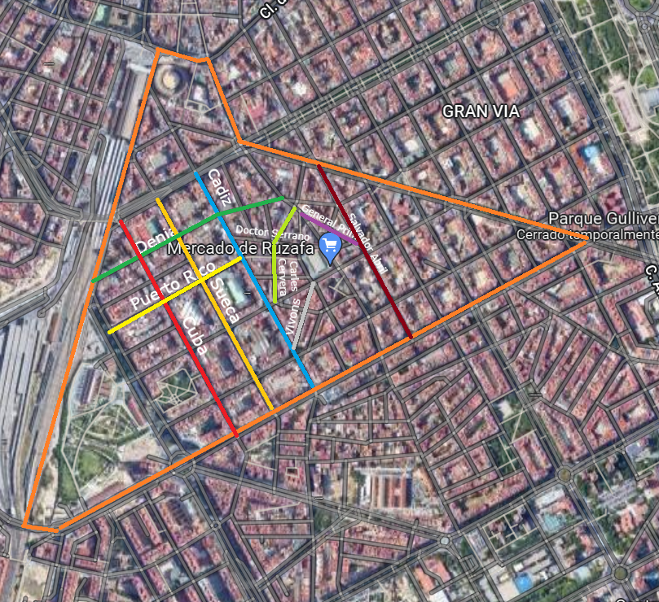

<style>
#TOC {
  color: #708090;
  font-family: Calibri;
  font-size: 16px; 
  border-color: #708091;
}
h1.title {
  color: #F08080;
  background-color: #F5F5F5;
  font-family: Calibri;
}
h4.author{
  color: #708090;
  font-family: Calibri;
}
h4.date{
  color: #708090;
  font-family: Calibri;
  font-size: 16px;
  background-color: #F5F5F5;
}
body {
  color: #708090;
  font-family: Calibri;
  background-color: #F5F5F5;
}
pre {
  color: #708090;
  background-color: #F8F8FF;
}
</style>

```{r setup, cache = F, echo = F, message = F, warning = F, tidy = F}

# CONFIGURACIÓN GENERAL
library(knitr)
options(width = 100)

# Opciones generales de los chucks. Se utilizarán salvo cambios en el chunk
opts_chunk$set(echo=T, message = F, error = F, warning = F, comment = NA, fig.align = 'center', dpi = 200, tidy = F, cache.path = '.cache/', fig.path = './figura/')

# Opciones generales de dígitos cuando se incluyen tablas
#options(xtable.type = 'html')
knit_hooks$set(inline = function(x) {
  
  if(is.numeric(x)) {
    round(x, getOption('digits'))
  } else {
    paste(as.character(x), collapse = ', ')
  }
})
#knit_hooks$set(plot = knitr:::hook_plot_html)
```

```{r, echo=F}
# Especificamos las librerías necesarias en esta lista

packages = c("readr","dplyr","lubridate", "tidyr","tibble", "ggplot2", "purrr", "stringr")

#use this function to check if each package is on the local machine
#if a package is installed, it will be loaded
#if any are not, the missing package(s) will be installed and loaded
package.check <- lapply(packages, FUN = function(x) {
  if (!require(x, character.only = TRUE)) {
    install.packages(x, dependencies = TRUE,repos='http://cran.rediris.es')
  }
  library(x, character.only = TRUE)
})

#verify they are loaded
#search()

```

```{r, include=FALSE}
#rm(list=ls())
```

## Previo

### Descarga ficheros
En primer lugar, descargamos todos los ficheros que vamos a utilizar en una carpeta llamada data.

```{r, Descarga datos de internet, echo=FALSE, message=FALSE, warning=FALSE}
# descargamos y almacenamos los datos en la carpeta data
dir.create("data")

url <- "https://opendata.vlci.valencia.es/datastore/dump/a54fb175-8013-460a-a2f0-22de7a210d7a?format=csv&bom=true"
download.file(url, destfile = "./data/SuecaEsqDenia.csv")

url2 <- "https://opendata.vlci.valencia.es/datastore/dump/75a878a9-2bd9-4619-98ec-3224be867c65?format=csv&bom=true"
download.file(url2, destfile = "./data/Cadiz16.csv")

url3 <- "https://opendata.vlci.valencia.es/datastore/dump/6fa5210b-f9c7-47c8-9d1f-ddb7568f62de?format=csv&bom=true"
download.file(url3, destfile = "./data/Cadiz3.csv")

url4 <- "https://opendata.vlci.valencia.es/datastore/dump/5a050cef-1107-4b3b-8e61-5daf5cfb2ca4?format=csv&bom=true"
download.file(url4, destfile = "./data/Cuba3.csv")

url5 <- "https://opendata.vlci.valencia.es/datastore/dump/e580f492-a2f6-4305-af24-f4c4d05b911c?format=csv&bom=true"
download.file(url5, destfile = "./data/Sueca2.csv")

url6 <- "https://opendata.vlci.valencia.es/datastore/dump/8058f1a5-c605-4baa-afff-2f638efb767f?format=csv&bom=true"
download.file(url6, destfile = "./data/Sueca61.csv")

url7 <- "https://opendata.vlci.valencia.es/datastore/dump/d842601d-35b4-4b88-96f7-42e8f68e1b74?format=csv&bom=true"
download.file(url7, destfile = "./data/Sueca32.csv")

url8<- "https://opendata.vlci.valencia.es/datastore/dump/ea008906-e06a-4c72-9fe6-3238e212aae4?format=csv&bom=true"
download.file(url8, destfile = "./data/CarlesCervera.csv")

url9<- "https://opendata.vlci.valencia.es/datastore/dump/64e4b7b4-e633-4753-b0ef-a57d785076f8?format=csv&bom=true"
download.file(url9, destfile = "./data/SalvadorAbril.csv")

url10<- "https://opendata.vlci.valencia.es/datastore/dump/ff8678b6-748e-4908-ab5b-9c7ff567da61?format=csv&bom=true"
download.file(url10, destfile = "./data/Vivons.csv")

url11<- "https://opendata.vlci.valencia.es/datastore/dump/b26d42ae-2be9-481a-9b79-71392d9e80bd?format=csv&bom=true"
download.file(url11, destfile = "./data/CarlesCervera34.csv")

url12<- "https://opendata.vlci.valencia.es/datastore/dump/1b41d86b-3939-488b-9035-92d851245924?format=csv&bom=true"
download.file(url12, destfile = "./data/PuertoRico21.csv")

url13<- "https://opendata.vlci.valencia.es/datastore/dump/784f4732-abc5-41b1-857b-42decb306643?format=csv&bom=true"
download.file(url13, destfile = "./data/DoctorSerrano21.csv")

url14<- "https://opendata.vlci.valencia.es/datastore/dump/3b2fe345-08fc-49d7-85c8-8cccf6a7e814?format=csv&bom=true"
download.file(url14, destfile = "./data/GeneralPrim.csv")

```

### Importacion
Una vez descargados los datos en forma de csv para cada calle vamos a importarlos y a guardarlos con el nombre de cada calle

```{r, Leer dataframe,  echo=FALSE, message=FALSE}
library(readr)

SuecaEsqDenia <- read_csv("./data/SuecaEsqDenia.csv") 
Cadiz16 <- read_csv("./data/Cadiz16.csv") 
Cadiz3 <- read_csv("./data/Cadiz3.csv") 
Cuba3 <- read_csv("./data/Cuba3.csv") 
Sueca2 <- read_csv("./data/Sueca2.csv")
Sueca61 <- read_csv("./data/Sueca61.csv")
Sueca32 <- read_csv("./data/Sueca32.csv")
CarlesCervera <- read_csv("./data/CarlesCervera.csv")
SalvadorAbril <- read_csv("./data/SalvadorAbril.csv")
Vivons <- read_csv("./data/Vivons.csv")
CarlesCervera34 <- read_csv("./data/CarlesCervera34.csv")
PuertoRico21 <- read_csv("./data/PuertoRico21.csv")
DoctorSerrano21 <- read_csv("./data/DoctorSerrano21.csv")
GeneralPrim <- read_csv("./data/GeneralPrim.csv")
```

### Imagen calles
Para visualizar como estan distribuidos los sensores incluimos una imagen con las calles de las que se tienen datos



### Agrupacion dataframes en un solo objeto
Para poder trabajar con todos los archivos juntos hemos creado una lista con todos los dataframes de las calles. De esta manera podemos manipular los datos conjuntamente. A cada dataframe, como es normal, le asignamos el nombre de la calle a la que pertenece.

```{r, Crear lista de dataframes}
calles = list(SuecaEsqDenia, Cadiz16, Cadiz3, Cuba3, 
              Sueca2, Sueca61, Sueca32, CarlesCervera, 
              SalvadorAbril, Vivons, CarlesCervera34, PuertoRico21, 
              DoctorSerrano21, GeneralPrim)

nombre_calles=c("SuecaEsqDenia", "Cadiz16", "Cadiz3", "Cuba3", 
                "Sueca2", "Sueca61", "Sueca32", "CarlesCervera", 
                "SalvadorAbril", "Vivons", "CarlesCervera34", "PuertoRico21", 
                "DoctorSerrano21", "GeneralPrim")
names(calles)=nombre_calles
```

## Primera inspeccion, dimensiones y variables

### Definición de variables

Antes de empezar a analizar en profundidad los datos los datos vamos a conocer qué representa cada variable

```{r}
#Escogemos un dataframe al azar y vemos sus variables
colnames(Cadiz3)
```

- _id: Identificador para cada recepcion de datos
- RecvTime: Fecha en la que se insertó el dato en la plataforma.
- FiwareServicePath: Servicio de la plataforma VLCi al que pertenece el sensor.
- EntityType: Tipo de entidad del sensor en la plataforma VLCi.
- EntityId: Identificador único del sensor en la plataforma VLCi.
- LAeq: Nivel sonoro continuo equivalente. El período establecido para este sensor es de 1 minuto.
- LAeq_d: Es un indicador de ruido asociado al día, donde al día le corresponden 12 horas, en el período que se extiende desde las 7 hasta las 19 horas.
- LAeq_den: índice de ruido día-tarde-noche, es utilizado para determinar la molestia vinculada a la exposición al ruido.
- LAeq_e: Es un indicador del nivel sonoro durante la tarde, donde a la tarde le corresponden 4 horas, en el período que se extiende desde las 19 hasta las 23 horas.
- LAeq_n: Es un indicador del nivel sonoro durante la noche, donde a la noche le corresponden 8 horas, en el período que se extiende desde las 23 hasta las 7 horas.
- Dateobserved: Día al que se refieren las medidas.

### Dimensiones
Antes de empezar a trabajar con los valores de los datos vamos a conocer como estan estructurados, si todos tienen el mismo numero de lineas y de columnas

```{r, Inspeccionar dataframes}
library(purrr)

#Averiguamos si las dimensiones de los dataframes son siempre las mismas
numero_columnas=unlist(map(calles, ncol), use.names = F)
numero_columnas #Numero de columnas de todos los dataframes
numero_filas=unlist(map(calles, nrow), use.names = F)
numero_filas #Numero de filas de todos los dataframes
```

Vemos en seguida que todos tienen el mismo numero de columnas, 11, suponemos que es porque son tantas como variables hemos analizado previamente.
Sin embargo, vemos que cada los dataframe tiene un numero diferente de columnas

Y ahora vamos a comprobar activamente que todos los dataframes tienen las mismas variables viendo si los nombres de las columnas son todos iguales

```{r, Inspeccionar dataframes}
#Ahora comprobamos si todos los dataframes tienen de hecho, las mismas variables
#Para ello vamos a comprobar que los nombres de las variables sean siempre 
#los mismos
comprobar_colnames = c()
for (a in map(calles, colnames)){
  nombres = (a == colnames(SuecaEsqDenia))
  comprobar_colnames = c(comprobar_colnames, nombres)
}

#Si todas son TRUE entonces todos los dataframes tienen las mismas columnas
all(comprobar_colnames==T)
```
Vemos como definitivamente, todos los dataframes tienen el mismo numero de columnas, sabiendo todo esto podemos trabajar con los datos conjuntamente con bastante seguridad.

### Tipos de variables
Finalmente, para asegurarnos todavía más de que podemos trabajar con todos los datos al mismo tiempo vamos a ver si los tipos de cada variable son los mismos en cada dataframe

```{r}
#Vamos a conocer el tipo de cada variable de un solo dataframe, 
#y luego comprobaremos si el resto de dataframes cumplen las mismas 
#caracteristicas
clases_calle = unlist(lapply(SuecaEsqDenia, class))
clases_calle #Vemos los tipos de cada variable de una calle

todas_las_clases=map(calles, function(x){unlist(lapply(x, class))})
comprobar_clases = c()
for (c in todas_las_clases){
  clase = (c == clases_calle)
  comprobar_clases = c(comprobar_clases, clase)
}

#Si el codigo devuelve TRUE significa que todos tienen el 
#mismo tipo de variables
all(setNames(comprobar_clases, NULL)==T)
```

Hemos comprobado que, efectivamente los tipos de las variables de los distintos dataframes coinciden en tipo

## Segunda inspeccion, datos anómalos

### Datos faltantes NA
En primer lugar vamos a analizar si existen datos con valor NA, y de ser así, qué tipo de datos faltantes son.

```{r}
#Y aqui averiguamos si algun dataframe tiene datos faltantes
#En el caso de que el resultado sea TRUE podremos estar seguros de que no aparecen datos faltantes
all(unlist(map(calles, function(x){all(!is.na(x))}))==T)
```

Vemos que no hay datos faltantes con valor NA

### Datos nulos
Repetimos el proceso para ver si hay datos con valor nulo.
```{r}
#Utilizamos una operacion paralela a la enterior.
all(unlist(map(calles, function(x){all(!is.null(x))}))==T)
```

Podemos corroborar que tampoca hay valores nulos

### Infinitos
Vamos a ver si puede ser que haya valores infinitos

```{r}
#Como al utilizar una funcion como las anteriores encontramos problemas 
#creamos el codigo que encuentre valores infinitos y que nos diga en qué 
#calles se encuentran si es que los hay y en qué variable los encuentra

busqueda_infinitos=c()
conjuntos_datos_infinitos = list()

dataframes_con_infinito = c()
columnas_con_infinito = c()

encontrar_dataframe=0
for (j in calles){
  encontrar_dataframe = encontrar_dataframe+1
  numero_columna=0
  for (k in j){
    numero_columna=numero_columna+1
    l = all(!is.infinite(k)) #Devuelve FALSE si encuentra infinito
    busqueda_infinitos=c(busqueda_infinitos, l)
    if (!l){
      conjuntos_datos_infinitos[[length(conjuntos_datos_infinitos) + 1]] = k
      nomcalle=names(calles)[encontrar_dataframe]
      nomvar=names(j)[numero_columna]
      print(paste(nomcalle, nomvar, sep="; "))
    }
  }
}

all(busqueda_infinitos) #Si el resultado es TRUE, no hay valores infinitos
#Si que hay valores que valen infinito
#Tendremos que tratar con ellos
```

Visto el resultado sabemos que hay valores infinitos en las calles CAlles Cadiz16 en la variable LAeq_e y en SalvadorAbril en LAeq_d

Viendo este resultado nos salta la primera pregunta, y es ¿por que encontramos en algunos dataframes muy extrañamente valores infinitos?

#### Comparacion infinitos con valores anteriores y posteriores
Vamos a buscar cuál puede ser la causa por la que puede ser que haya valores infinitos, para hacer el estudio vamos a empezar comparando con los valores anteriores y posteriores carcanos al que encontramos que vale infinito, y tambien vamos a ver la posicion dentro del dataframe, por si nos puede ser de ayuda

```{r}
for (m in 1:length(conjuntos_datos_infinitos)){
  n = which(conjuntos_datos_infinitos[[m]]==Inf)
  print(n)
  print(conjuntos_datos_infinitos[[m]][(n-5):(n+5)])
}
```
No vemos un motivo aparente por los que los valores son erroneos con relacion a los datos cercanos suyos. Los valores anteriores y posteriores a los dias que aparecio el infinito no parecen anómalos

#### Comparacion infinitos con resto de variables
Hemos averiguado los dataframes de donde provienen los errores, y las columnas, ahora vamos a ver si puede haber relacion entre otras variables.
```{r}
rbind(
Cadiz16 %>% filter(LAeq_e==Inf),
SalvadorAbril %>% filter(LAeq_d==Inf)
)
```

No se encuentra ningun tipo de relacion entre las variables por las que se pueda sospechar que estos datos fueran erroneos.

#### Comparacion infinitos con otras observaciones
Ahora que sabemos el _id de las observaciones con valor infinito vamos a ver si podemos encontrar alguna relacion entre lo ocurrido con observaciones anteriores; de no encontrarlo tomaremos los valores como completamente aleatorios

```{r}
filter(Cadiz16, Cadiz16[,1]>194 & Cadiz16[,1]<202)
filter(SalvadorAbril, SalvadorAbril[,1]>122&SalvadorAbril[,1]<130)
```
No encontramos ninguna anomalia aparente entre las distintas observaciones, de hecho, sabemos que los dias siguientes continuó habiendo registros sin cambio alguno

Tomaremos los infinitos como datos faltentes completamente aleatorios, y como son muy pocos datos erroneos, la mejor solucion es eliminarlos directamente de los dataframes.

```{r}
#Eliminamos los registros que valen infinito
Cadiz16=Cadiz16 %>% filter(!LAeq_e==Inf)
SalvadorAbril=SalvadorAbril %>% filter(!LAeq_d==Inf)
calles$Cadiz16=Cadiz16
calles$SalvadorAbril=SalvadorAbril
```

### Cambiar nombre variables
Como algunos nombres no quedan muy claros vamos a cambiarle los nombres para que se vea mas claro que representa cada dato
```{r}
calles_renombradas = list()
for (r in calles){
  s = r %>% rename("noise_min" = LAeq, 
                   "noise_morning"=LAeq_d, 
                   "noise_all"=LAeq_den,
                   "noise_afternoon"=LAeq_e,
                   "noise_night"=LAeq_n)
  calles_renombradas[[length(calles_renombradas) + 1]] = s
}
names(calles_renombradas)=nombre_calles
calles = calles_renombradas
```


### Estadisticos
Estos datos estadisticos son sobre todos las calles en todos los años
```{r}
estadisticos = function(x){
  minimo = round(min(x, na.rm=T),2)
  percentil_25 = round(quantile(x, 0.25, na.rm=T),2)
  mediana = round(median(x, na.rm=T),2)
  media = round(mean(x, na.rm=T),2)
  desviacion_tipica = round(sd(x, na.rm=T),2)
  percentil_75 = round(quantile(x, 0.75, na.rm=T),2)
  maximo = round(max(x, na.rm=T),2)
  vector = c(minimo, percentil_25, mediana, media, desviacion_tipica, percentil_75, maximo)
  names(vector)=NULL
  return (vector)
}
```

```{r}
lista_estadisticos = list()
for (e in calles){
  matriz_estadisticos=matrix(ncol=7)
  for (f in e[,6:10]){
    g = estadisticos(f)
    matriz_estadisticos = rbind(matriz_estadisticos, g)
  }
  matriz_estadisticos = matriz_estadisticos[2:6,]
  colnames(matriz_estadisticos)=c("minimo", "percentil_25", "mediana", "media", "desviacion_tipica", "percentil_75", "maximo")
  rownames(matriz_estadisticos)=colnames(e[,6:10])
  #Recordar cambiar el nombre de las lineas
  #print(matriz_estadisticos)
  lista_estadisticos[[length(lista_estadisticos) + 1]] = matriz_estadisticos
}
names(lista_estadisticos)=nombre_calles
print(lista_estadisticos)
```

### Diferenciar años

Para que el trabajo quede mas claro vamos a separar los datos en 3 rmd distintos, uno por año, así podemos investigar mas a fondo como varia el sonido en cada uno de los años y a la vista queda mucho mas claro tambien.

Creamos una columna año que despues utilizaremos para los facets

### Unir dataframes
```{r}
#Puede que eliminemos este chunk tambien
#Comprobamos si algunas columnas nos son completamente inutiles, para poder eliminarlas
# comprobamos usando unique que columnas tienen una misma observación en todo el df

length(unique(SuecaEsqDenia$fiwareServicePath)) 
length(unique(SuecaEsqDenia$entityType)) 
length(unique(SuecaEsqDenia$entityId))

# vemos que las columnas 3,4,5 no son importantes porque siempre es la misma observación
```

```{r}
numero_niveles=c()
for (o in calles){
  for (p in o[,3:5]){
    q=length(unique(p))
    numero_niveles = c(numero_niveles, q)
  }
}
all(numero_niveles==1)
#Las variables que repiten todo el tiempo el mismo valor no nos interesan, la eliminamos
```


```{r}
datos = rbind(Cadiz16 %>% select(1, 6:11) %>% mutate(Street="Cadiz16"),
               Cadiz3 %>% select(1, 6:11) %>% mutate(Street="Cadiz3"),
               CarlesCervera %>% select(1, 6:11) %>% mutate(Street="CarlesCervera"),
               CarlesCervera34 %>% select(1, 6:11) %>% mutate(Street="CarlesCervera34"),
               Cuba3 %>% select(1, 6:11) %>% mutate(Street="Cuba3"),
               DoctorSerrano21 %>% select(1, 6:11) %>% mutate(Street="DoctorSerrano21"),
               GeneralPrim %>% select(1, 6:11) %>% mutate(Street="GeneralPrim"),
               PuertoRico21 %>% select(1, 6:11) %>% mutate(Street="PuertoRico21"),
               SalvadorAbril %>% select(1, 6:11) %>% mutate(Street="SalvadorAbril"),
               Sueca2 %>% select(1, 6:11) %>% mutate(Street="Sueca2"),
               Sueca32 %>% select(1, 6:11) %>% mutate(Street="Sueca32"),
               Sueca61 %>% select(1, 6:11) %>% mutate(Street="Sueca61"),
               SuecaEsqDenia %>% select(1, 6:11) %>% mutate(Street="SuecaEsqDenia"),
               Vivons %>% select(1, 6:11) %>% mutate(Street="Vivons")
               ) %>% rename("noise_min" = LAeq, 
                            "noise_morning"=LAeq_d, 
                            "noise_all"=LAeq_den,
                            "noise_afternoon"=LAeq_e,
                            "noise_night"=LAeq_n)
```

```{r}
#Los datos imporatnte solo son los que hemos elegido, el resto son metadatos
datos2 = 
  Cadiz16 %>% dplyr::select(1, 6:11) %>% mutate(Street="Cadiz16")%>% 
  full_join(Cadiz3 %>% select(1, 6:11) %>% mutate(Street="Cadiz3")
            , by="dateObserved", suffix=c("_Cadiz16", "")) %>% 
  full_join(CarlesCervera %>% select(1, 6:11) %>% mutate(Street="CarlesCervera")
            , by="dateObserved", suffix=c("_Cadiz3", "")) %>% 
  full_join(CarlesCervera34 %>% select(1, 6:11) %>% mutate(Street="CarlesCervera34")
            , by="dateObserved", suffix=c("_CarlesCerCh", "")) %>%
  full_join(Cuba3 %>% select(1, 6:11) %>% mutate(Street="Cuba3")
            , by="dateObserved", suffix=c("_CarlesCer34", "")) %>% 
  full_join(DoctorSerrano21 %>% select(1, 6:11) %>% mutate(Street="DoctorSerrano21")
            , by="dateObserved", suffix=c("_Cuba3", "")) %>% 
  full_join(GeneralPrim %>% select(1, 6:11) %>% mutate(Street="GeneralPrim")
            , by="dateObserved", suffix=c("_Serrano21", "")) %>% 
  full_join(PuertoRico21 %>% select(1, 6:11) %>% mutate(Street="PuertoRico21")
            , by="dateObserved", suffix=c("_GenPrim", "")) %>% 
  full_join(SalvadorAbril %>% select(1, 6:11) %>% mutate(Street="SalvadorAbril")
            , by="dateObserved", suffix=c("_PuertoRico21", "")) %>% 
  full_join(Sueca2 %>% select(1, 6:11) %>% mutate(Street="Sueca2")
            , by="dateObserved", suffix=c("_SalvadorAbril", "")) %>% 
  full_join(Sueca32 %>% select(1, 6:11) %>% mutate(Street="Sueca32")
            , by="dateObserved", suffix=c("_Sueca2", "")) %>% 
  full_join(Sueca61 %>% select(1, 6:11) %>% mutate(Street="Sueca61")
            , by="dateObserved", suffix=c("_Sueca32", "")) %>% 
  full_join(SuecaEsqDenia %>% select(1, 6:11) %>% mutate(Street="SuecaEsqDenia")
            , by="dateObserved", suffix=c("_Sueca61", "_SuecaDenia"))
```

```{r}
#Datos obtenidos de https://www.foro-ciudad.com
datos=datos %>% mutate(long = case_when(
  str_detect(Street, "Cadiz")~692,
  str_detect(Street,"CarlesCervera")~282,
  Street=="DoctorSerrano21"~180,
  Street=="SuecaEsqDenia"~mean(c(572, 682)),
  str_detect(Street,"Sueca")~682,
  Street=="SalvadorAbril"~548,
  Street=="PuertoRico21"~419,
  Street=="Cuba3"~715,
  Street=="Vivons"~193,
  Street=="GeneralPrim"~219,
  TRUE~0
))
```

### Estadisticos de todo el dataframe
```{r}
estadisticos_conjuntos=matrix(ncol=7)
for (h in datos[,2:6]){
    i = estadisticos(h)
    estadisticos_conjuntos = rbind(estadisticos_conjuntos, i)
}

estadisticos_conjuntos=estadisticos_conjuntos[2:6,]
colnames(estadisticos_conjuntos)=c("minimo", "percentil_25", "mediana", "media", "desviacion_tipica", "percentil_75", "maximo")
rownames(estadisticos_conjuntos)=colnames(datos[,2:6])
estadisticos_conjuntos
```

```{r}
datos = datos %>% mutate(year = year(dateObserved))
unique(datos$year)
datos_2020 = datos %>% filter(year==2020)
datos_2021 = datos %>% filter(year==2021)
datos_2022 = datos %>% filter(year==2022)
```

```{r}
datos_tidy = datos %>% gather("noise", "value", 2:6) %>% separate(noise, into=c("noise_column", "noise"), sep="_") %>% select(-noise_column) %>% mutate(noise=as.factor(noise), Street=as.factor(Street))%>% 
  mutate(level=case_when(
    between(value, 10, 30) ~ "Very Low", 
    between(value, 30, 50) ~ "Low", 
    between(value, 50, 65) ~ "Medium", 
    between(value, 65, 80) ~ "Loud", 
    TRUE ~ "Very Loud"
), level=as.factor(level))
head(datos_tidy)
```

Para posteriormente poder trabajar con ellos guardamos los datos en sus respectivos Rdata
```{r}
dir.create("dataframes")

save(datos_2020, file="./dataframes/datos_2020.Rdata")
save(datos_2021, file="./dataframes/datos_2021.Rdata")
save(datos_2022, file="./dataframes/datos_2022.Rdata")
```

##Preguntas generales
Como hemos dividido los datos en 3 rmd diferentes en este que seria como el que une los 3 años , estan las preguntas respectivas a los 3 a la vez

- ¿En que año hubo mas y menos ruido?
- ¿Como afecto la cuarentena al sonido percibido?
- ¿En que epocas del año se produce mas ruido (navidas, verano...)?
- ¿Coinciden los meses con mas y menos sonido?
- ¿Coinciden las calles con mas y menos sonido?
- ¿El ruido aumenta , dismunuye o se mantiene con el paso del tiempo?
- ¿Porque hay datos infinitos?